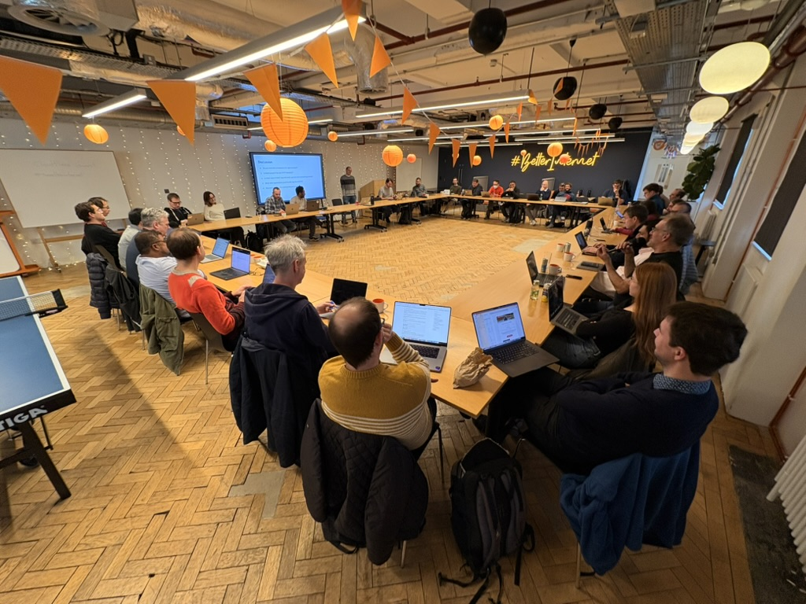

# 2024 HTTP Workshop Report

The sixth HTTP Workshop was held on 12-14 November, 2024 at [Cloudflare](https://cloudflare.com/)'s London offices.

This year, 39 people representing different parts of the industry showed up to discuss HTTP.

## Topics Covered

As always, our conversations ranged over experiences with HTTP as deployed, current standards work and possible future developments.

For details, see the [presentations](talks/) along with Daniel Stenberg's summaries of the discussion ([day 1](https://daniel.haxx.se/blog/2024/11/13/the-2024-http-workshop/), [day 2](https://daniel.haxx.se/blog/2024/11/13/the-2024-workshop-day-two/), [day 3](https://daniel.haxx.se/blog/2024/11/14/workshop-season-six-episode-three/)).

## What's Good About the HTTP Workshop

Twenty participants responded to the post-Workshop feedback survey. Once again, they felt the workshop was a useful event, with all responses rating at 7 out of 10 or higher:

When asked what the best aspect of the workshop was, we got responses such as:

> Sharing of real life experience with HTTP, people openly and respectfully discussing controversial topics.

> Openness in discussions regarding difficulties, the ability to speak about potential new designs, the topics covered, and the always welcoming approach of the Program Committee.

> Meeting a wide spectrum of people from the industry and hearing about their operational issues/ideas/workflows.

> Exchanges between peoples with a high technical experiences without any filter.

> The level of expertise in the room and how friendly and welcoming everyone was.

> Connecting with implementers, particularly those who are not frequent at the IETF. Meeting new people in the space. The openness with which practitioners are willing to talk about their setups.

> Open, polite and friendly discussions. Also that the workshop is not too big so it is possible to connect with many people.

> The format itself. Short presentations with longer discussions and frequent breaks to talk to the other participants. Overlap with activity at the IETF was limited, which is good.

> The people. Being able to hear thoughts and have conversations with smart people with common interests.

## Not so Good

When we asked for the worst aspect of the workshop, there was a recurring theme of problems hearing everyone. We introduced a microphone after the first session, when it became clear that the size of the audience made audio difficult, but this obviously wasn't enough.

We also had a few people point out that the last day being a short half day wasn't a good use of time. Based on feedback we received in the room, it's likely that we'll make the next Workshop a full three days.

Likewise, one or two people pointed out that knowing about topics in advance would allow people to prepare. This was discussed extensively in the room, and we'll be doing more preparatory work next time around.

A more substantive issue that came up in a few responses was the topics of the discussion:

> With concerns from both high and low in the stack it can be hard to keep everyone engaged at all times. This is probably unavoidable, but it's always a bit disappointing.

> There were 1-2 discussions that went too much into details [..], I would prefer that discussion was more high-level. But that is a part of an open discussion, so it may not be possible to fix it.

> The topics were heavy on the transport-side, compared to the application-side, for example.

> The bias towards transport details.

Remarkably, there was no outright concern expressed about diversity. We saw good steps taken this time, and will work to further improve in future workshops.

## The Future of the HTTP Workshop

In the past, we've discussed making the Workshop larger to reach a broader audience, and to help with diversity. However, we're getting strong feedback that the format we use -- casual discussion led by the group -- won't scale well past a certain size (perhaps 40 or 45 people). Supporting a larger event would mean finding a new format and likely require additional resources that we don't currently have. So, if the Workshop returns, it will likely be in the same format and about the same size.

## Acknowledgements

Many thanks again to our sponsors:

* [Cloudflare](https://cloudflare.com/) - Workshop venue
* [Akamai](https://akamai.com/) - Welcome reception
* Anonymous sponsor - Workshop dinner

## Who Came

Workshop attendees in 2024 were:

* Mohammed Al Sahaf (Independent)
* Hooman Beheshti (Fastly)
* Cory Benfield (Apple)
* Theophilus Benson (Carnegie Mellon University, Africa)
* Mike Bishop (Akamai)
* YuLing Chen (Meta)
* Antoine Cordelle (Cloudflare)
* Dragana Damjanovic (Microsoft)
* Amaury Denoyelle (HAProxy)
* Frederik Deweerdt (Fastly)
* Stefano Duo (Google)
* Uttaran Dutta (Akamai)
* Lars Eggert (Mozilla)
* Stefan Eissing (Independent)
* Roy Fielding (Adobe)
* Alan Frindell (Meta)
* Nils Goroll UPLEX / Varnish Cache Project)
* Nidhi Jaju (Google)
* Anne van Kesteren (Apple)
* Eric Kinnear (Apple)
* Marius Kleidl (Transloadit)
* Vijay Mamidi (Apple)
* Darrel Miller (Microsoft)
* Luca Niccolini (Meta)
* Mark Nottingham (Cloudflare, PC)
* Piers O'Hanlon (BBC)
* Kazuho Oku (Fastly)
* Francesca Palombini (Ericsson)
* Lucas Pardue (Cloudflare)
* David Schinazi (Google)
* Marten Seemann (Independent)
* Nick Shadrin (NGINX)
* Piotr Sikora (Independent)
* Daniel Stenberg (Curl)
* Jianfeng Tang (Meta)
* Willy Tarreau (HAProxy)
* Mark Thomas (Apache Tomcat Project)
* Martin Thomson (Mozilla, PC)
* Guoye Zhang (Apple)

